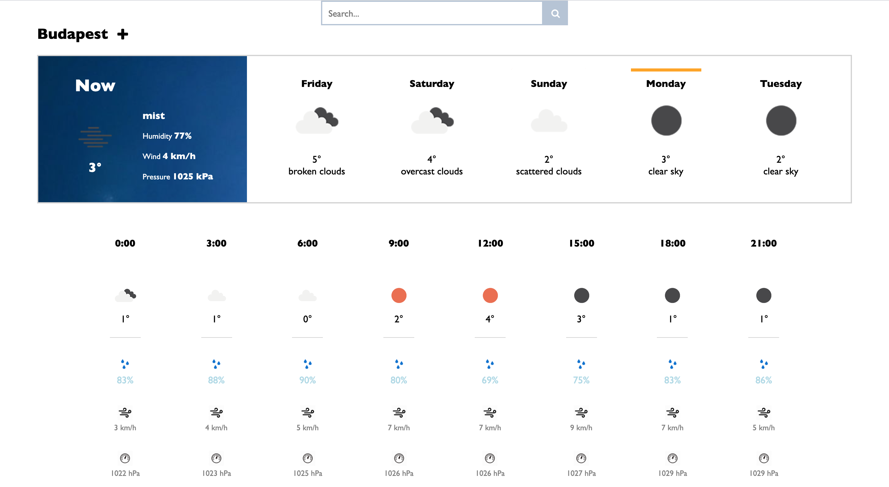

## Weather App

### About

Look up weather forecasts or the current weather for any location, and save favorites to track the current weather of multiple locations.

This is an **ASP.NET Core web application** serving as the backend for the Weather App.

### Project structure

#### WeatherApp.WebSite

The Website project contains everything needed to run the application, mainly models, controllers, and services.

**Models**:

- persist data in in-memory and/or sql _repositories_ using **Entity Framework Core**

**Controllers**:

- provide an API for CRUD operations
- endpoint example: GET https://localhost:44336/api/weatherforecast/budapest/

**Services**:

- fetch the latest weather data from the [Openweather API](https://openweathermap.org/)
- deserialize models from JSON responses

#### WeatherApp.Tests

The Test project uses `NUnit` and `NSubstitute` for mock testing _controllers_. Further tests are in the pipeline!

### Tech used / Dependencies

- Target framework: .NET Core 3.1
- NuGet packages include:
  - [Entity Framework Core](https://www.nuget.org/packages/Microsoft.EntityFrameworkCore/5.0)
  - [Entity Framework Core SQL Server](https://www.nuget.org/packages/Microsoft.EntityFrameworkCore.SqlServer/5.0)
  - [NUnit](https://www.nuget.org/packages/NUnit/3.11.0)
  - [NSubstitute](https://www.nuget.org/packages/NSubstitute/4.2.2)

### Setup

- Update your database to the latest migration:
  - `dotnet ef database update` using the .NET Core CLI
  - `Update-Database` using Visual Studio

---

